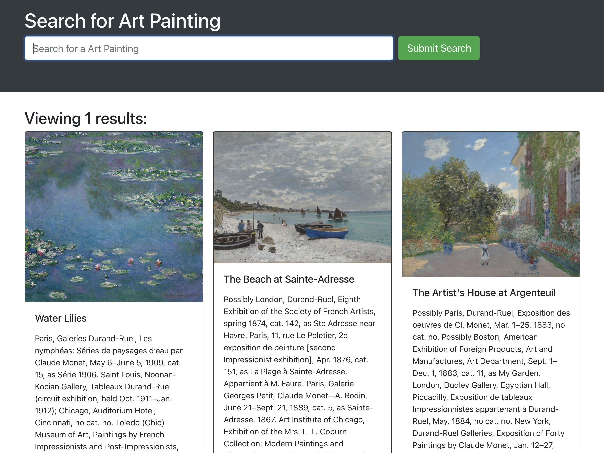

# artist-store
Mern-Stack-Project
## Description

This MERN stack project allows you to search for art paintings. Once you create an account, you can save paintings to your list and then delete them if you wish.

## Table of Contents

- [Installation](#installation)
- [Usage](#usage)
- [License](#license)

## Installation

To use this repo on your local machine, you will need Node.js. After cloning the code to your local device, be sure to run `node npm install` to include essential npm packages.

## Usage

On load, the website will show the main landing page. From here you can search for books using the search bar. Click sign up to create an account, or login to log back into your created account. This will allow you to click `Save Painting` on any books you like. You can then view your saved books by clicking `See Your Paintings`, and also delete books from your list using the `Delete This Painting` button.
f
To view the live page: [Click Here]("/")

## License

- GitHub: [@github](https://github.com/vloriandervishi/artist-store)